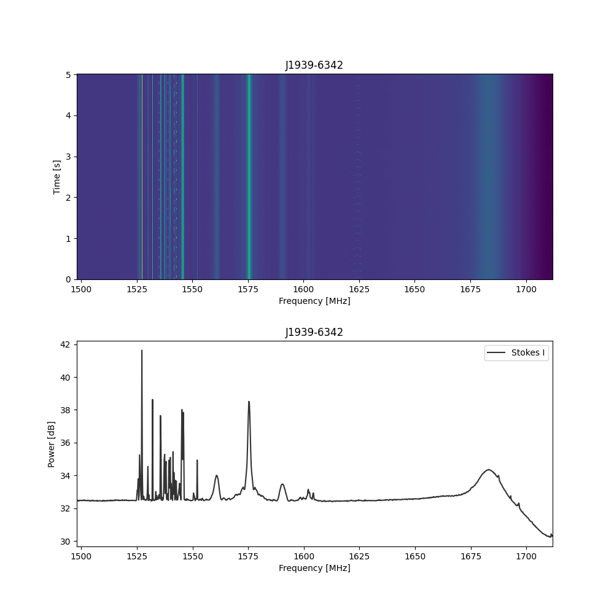

Generate ics filterbanks by looping through GPU nodes
splice them together
plot bandpass using blimpy

Requirement:
* Intended to be used on the MeerKAT GPU node. 
* blimpy & python3
* Access to .raw data across nodes
* splice2 (part of bl-sigproc)

See example output 
